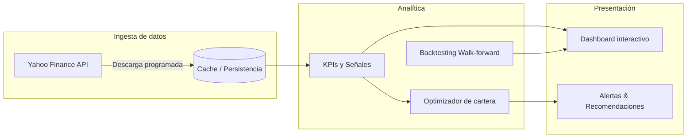

# Arquitectura Inicial de la Plataforma

Este documento resume los componentes principales que vamos a construir para la
plataforma inteligente de gestión de carteras. El objetivo es sentar unas bases
claras para que podamos iterar de forma incremental sin perder de vista la
experiencia de usuario final.

## 1. Capas principales

1. **Ingesta de datos (Data Layer)**
   - *Fuentes*: API de Yahoo Finance vía [`yfinance`](https://github.com/ranaroussi/yfinance).
   - *Responsabilidades*: descarga de precios históricos, homogeneización de
     símbolos, control de fechas/intervalos y normalización de los `DataFrame`
     para facilitar su consumo por la capa de analítica.
   - *Implementación inicial*: módulo `smart_portfolio_viz.data.yahoo` con la
     clase `PriceRequest` y los helpers `download_price_history` y
     `build_price_frame`.

2. **Analítica y modelos (Analytics Layer)**
   - *Responsabilidades*: cálculo de métricas de rendimiento/riesgo,
     comparación con benchmarks, preparación de series para optimización y
     backtesting, señalización inicial (momentum, reversión, volatilidad).
   - *Implementación inicial*: módulo `smart_portfolio_viz.analytics.portfolio`
     que ofrece cálculos básicos (rentabilidades logarítmicas, Sharpe, drawdown,
     tracking error, etc.). Servirá de base para extender señales cuantitativas
     y optimizadores.

3. **Capa de presentación (Presentation Layer)**
   - *Responsabilidades*: cuadros de mando interactivos, autenticación,
     configuración de carteras personalizadas, explicación de recomendaciones.
   - *Estado actual*: pendiente de definición tecnológica (Streamlit, Dash,
     Next.js + API, etc.). Requiere mockups y definición de flujos de usuario.

4. **Orquestación y servicios (Service Layer)**
   - *Responsabilidades*: exponer APIs, programar tareas de actualización,
     gestionar la persistencia (base de datos relacional o documental) y
     asegurar observabilidad.
   - *Estado actual*: por definir. En fases iniciales podemos apoyarnos en
     notebooks y scripts; más adelante migraremos a servicios gestionados.

## 2. Flujo de datos

## 3. Hoja de ruta inmediata

1. **Validar ingesta**: probar descarga de históricos con varios universos
   (acciones, ETFs, índices) y establecer política de manejo de huecos.
2. **Enriquecer métricas**: añadir cálculos de riesgo (VaR/CVaR), atribución de
   rentabilidad y factores (beta, momentum, value).
3. **Definir UI**: prototipar dashboard en Figma y seleccionar tecnología para
   el front-end (p. ej. Streamlit para MVP vs. stack React completo).
4. **Persistencia y autenticación**: decidir mecanismo (PostgreSQL + Supabase,
   Firebase, etc.) y diseñar esquema de usuarios/portfolios.
5. **Motor de recomendaciones**: combinar señales cuantitativas con un motor de
   reglas que genere alertas accionables, acompañado de explicaciones.

## 4. Próximos entregables técnicos

- Notebooks de exploración que utilicen los módulos de datos y analítica.
- Scripts CLI para refrescar precios y generar reportes periódicos.
- Pipeline de backtesting (scikit-learn + ``skforecast``/``statsmodels`` para
  pronósticos de retornos, ``cvxpy`` para optimización con restricciones).
- Integración con herramientas de seguimiento de tareas y documentación
  (Notion, Jira, Linear) para coordinar el desarrollo.

## 5. Consideraciones adicionales

- **Gobierno de datos**: logs de ingesta, control de calidad, gestión de
  credenciales (dotenv/secret manager).
- **Escalabilidad**: planificar despliegue en contenedores y evaluar servicios
  gestionados (AWS Lambda, Google Cloud Run) para tareas periódicas.
- **Cumplimiento**: aunque el proyecto es personal, mantener buenas prácticas de
  seguridad (HTTPS, cifrado en reposo, autenticación multifactor) y claridad en
  las limitaciones legales de las recomendaciones automatizadas.

---

Este documento evolucionará conforme vayamos cerrando decisiones tecnológicas y
requisitos funcionales. Mantengámoslo como referencia viva del estado del
producto.
